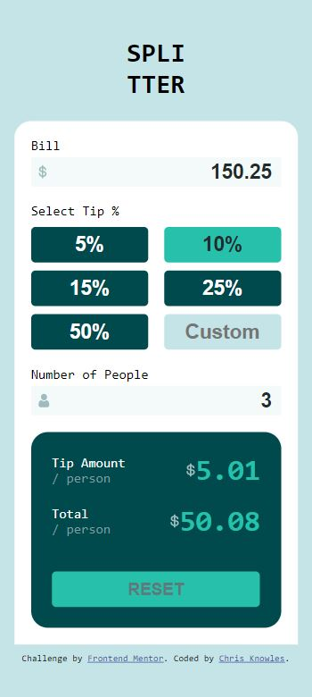

# Frontend Mentor - Tip calculator app solution

This is my solution to the [Tip calculator app challenge on Frontend Mentor](https://www.frontendmentor.io/challenges/tip-calculator-app-ugJNGbJUX). <br> I took this challenge on to push myself to learn the frontend skills required to make an app look as good as I could make them functionally work.<br>The second part of challenging myself was to write the project in native javascript rather than a REACT.js project. I did this because I felt like I was forgetting some of the basics I had been taught earlier in my course.

## Table of contents

- [Overview](#overview)
  - [The challenge](#the-challenge)
  - [My Solution](#my-solution)
  - [Links](#links)
- [My process](#my-process)
  - [Built with](#built-with)
  - [What I learned](#what-i-learned)
- [Continued development](#continued-development)
- [Useful resources](#useful-resources)

## Overview

### <u>The challenge</u>

Users should be able to:

- View the optimal layout for the app depending on their device's screen size
- See hover states for all interactive elements on the page
- Calculate the correct tip and total cost of the bill per person

These are the images of the mobile and desktop versions I had to recreate

| Mobile Design                               | Desktop Design                                          |
| ------------------------------------------- | ------------------------------------------------------- |
|  |  |

### <u>My Solution</u>

These are images of my final solution

| Mobile Image                                | Desktop Image                                 |
| ------------------------------------------- | --------------------------------------------- |
|  |  |

### <u>Links</u>

- Solution URL: [github.com/ChrisKnowles53](https://github.com/ChrisKnowles53/CJK_TipCalc_Frontend_Mentor)

  ⏰ make it live on GitHub and put link here - Live Site URL: [Add live site URL here](https://your-live-site-url.com)

## My process

### <u>Built with</u>

- Semantic HTML5 markup
- CSS custom properties
- Flexbox
- native javascript
- Mobile-first workflow

### <u>Planning</u>

|                     |                         |
| --------------------| ----------------------- |
|  | The first thing I did was look at the desired mobile view and put boxes around the items I thought needed to be grouped together. I then compared this to the desktop version to make sure the boxes I had created were transferable to the desktop design. For the desktop version the top brown box would have to move down and to the left. by visualising this I could then think about where to specific containers in the HTML. |

### <u>HTML</u>

I then coded the HTML file so it contained all the necessary text and images. I endeavoured to create all the necessary divs and containers with class names to enable me to style the page accordingly. I had to revisit this during the styling to add extra divs and to change class names where I realised I could re-use a class to avoid duplicate styling.

### <u>CSS</u>

I then started to created the CSS styling using a live sever of the page so I could see the changes. I also used border boxes around the containers so I could see exactly what elements were in the containers. I found this first part of the styling tricky as I got to grips with flexbox and how it interacted with the elements, due to this I took a break from styling and wrote the javascript file.
The main focus was to get the mobile version completed which I took some advice from a mentor to get it working properly. I had used margin and padding to position elements in places where I didn't need to if I used Flexbox correctly.

### <u>Javascript</u>

The javascript was tackled in a plan it first and build the code in manageable sections that were easily manually tested. Once I had the basic functionality I then started to add the event listeners so that when the inputs were changed the calculations updated automatically. This made me realise that the end user could have issues if they didn't enter the correct information. To give the end user the best experience I limited the inputs to numbers and added an error message that pops up if the user deletes the number of people. After this I went back to finish the styling.

### <u>Desktop Version</u>

I then tackled the desktop version where I used the @media query to change the layout, I did this initially by having an @media query at the end of my CSS. After discussing this and taking onboard some advice I refactored the CSS code so the @media query is in each CSS element so you don't have to scroll up and down to see what is changing in the class and media query.

## What I learned

Planning - with the knowledge gained completing this exercise i will be abel to plan the next project better.  I now have a much better understanding how to layout the containers in the beggining so that when I style it they are there ready for use. 

Flexbox - how to set up the html and css to use flexbox to position elements on the page. I also learnt that fi you set up the containers correctly the children inherit the parents properties and this reduces the number of lines of code in your CSS.  This was also essential when switching between mobile and desktop.

@media Queries - I learnt how to make these function and the importance of setting up the flexbox correctly in the first place so I can adjust using the layout by switching flex direction.  At the end i refactored the code so placing the media query in the same class as the element you are changing.  This made reading the code a lot easier as you weren't scrolling up and down to see what your media query is changing it to and from.

Vanilla Javascript is powerful and I don't want to loose the skill of being able to code this way. REACT.js and vanilla js have there places to be used and I want to be able to use both.

An example of how I included the media query in the class:

```css
.bill-tip-people-container {
  display: flex;
  flex-direction: column;
  justify-content: space-between;
  gap: 20px;

  @media screen and (min-width: 700px) {
    width: 350px;
  }
}
```

This is the method I used for adding an error message if the user deleted the number of people:

```js
} else {
    totalPerPersonElement.textContent = "";
    tipPersonElement.textContent = "";

    if (!errorElement) {
      const errorElement = document.createElement("p");
      errorElement.classList.add("error-message");
      errorElement.textContent = "Number of people cannot be empty";

      const numberOfPeopleContainer = document.querySelector(
        ".title-icon-input-container2"
      );
      numberOfPeopleContainer.appendChild(errorElement);
    } else {
      errorElement.style.display = "block";
    }
```

## Continued development

I will continue with Frontend Mentor challenges and pick one now that I think uses both grid and flexbox so I can be confident that I can use them both together.

I will also continue to use vanilla javascript to keep my skills up to date and to be able to use it when I need to.

## Useful resources

- [Beginners guide to @media queries ](https://css-tricks.com/a-complete-guide-to-css-media-queries/) - This helped me to understand media queries and the information is well laid out so was easy to digest.
- [How to use Markdown](https://www.markdowntutorial.com/) - This was essential to create this ReadMe as I had not used markdown up until now.

